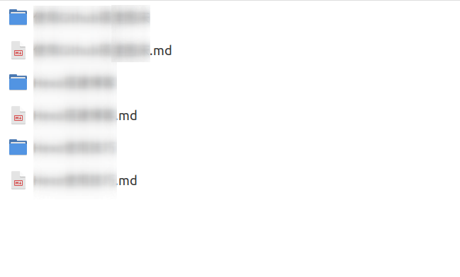
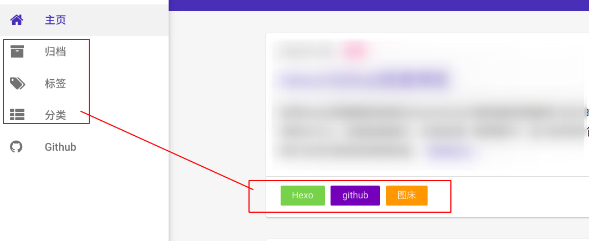
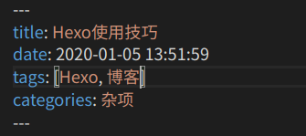

# Hexo使用技巧

在搭建GIthub图床的过程中，我遇到了图片的问题，其实在使用Hexo的过程中我还遇到了大大小小的不同的问题，这篇文章统统的记录一下方便以后再遇到类似的问题的时候能够更方便的解决。

<!--more-->

## 摘要问题
使用`<!--more-->`标签即可设置摘要，将该标签放置在摘要和正文之间，在Hexo预览的时候就能够显示摘要内容
## 图片问题
前一篇文章中提到了使用图床来事文章显示图片的方法，但其实这种方法是过于麻烦的，首先你需要获得 图片的链接，然后将该图片插入等你写的MarkDown文章中，好处在于你全部的图片都是存放在GIthub一个项目中的，坏处就是所有文章图片都在一起，没办法管理。Hexo提供了MarkDown文章插入图片的方法。
### 插入图片准备工作
执行
```bash
npm install hexo-asset-image --save
cnpm install hexo-asset-image --save//如果你安装了cnpm的话
```
然后在`_config.yml`文件中把`post_asset_folder: true`设置为True此时如果执行
```bash
hexo n 新文章名称
```
就会看到除了创建了一片新文章之外，还有一个和新文章名称一致的文件夹，这个文件夹就能够放置一些和该篇文章相关的图片。

### MarkDown插入图片
插入图片的语句就是MarkDown标准的插入图片的语句
```

```
## 标签及分类问题
标签和分类在博客中显示的效果大概如图所示

开启标签和分类功能也很简单，bash中执行
```bash
hexo new page tags
hexo new page categories
```
即可以看见在source文件夹下生成了/tags、/categories文件夹
然后修改`scaffolds/post.md`文件，设置每次创建的博客模板
```
---
title: {{ title }}
date: {{ date }}
tags:
categories:
---
```
### 标签用法
多标签`tags: [标签1,标签2,标签3......]`


### 草稿
#### 新建草稿
```bash
$ hexo new draft  文章名字
```
执行完命令之后你会在`source/_drafts`找到你的草稿文章，Hexo 另外提供` draft `机制，它的原理是新文章将建立在` source/_drafts` 目录下，因此 `hexo generate` 并不会将其编译到 `public `目录下，所以` hexo deploy `也不会将其部署到 GitHub。
#### 预览草稿
```bash
 hexo S --draft
```
和`hexo s`一样访问<http://localhost:4000/>预览


#### 将草稿发布为正式文章
```bash
$ hexo P <filename>
```
其中` filename`为不包含 `md` 后缀的文章名称。它的原理只是将文章从 `source/_drafts `移动到 `source/_posts `而已。之后的` hexo generate` 与 `hexo deploy` 的用法就完全一样了。若日后想将正式文章转为为草稿，只需手动将文章从 `source/_posts` 目录移动到` source/_drafts` 目录即可。


### 坑点
如果发现在网站上访问不了你的博客，比如我把仓库改成了私有的后发现怎么也访问不了了，改回公开仓库也不行，这里的解决方法就是删除文件夹下面的`.deploy_git`文件夹，再次上传部署就能够访问了，其实如果出现了404多半事Hexo本身的问题，在github方面出错不太可能，所以如果博客整个都崩了，那就把整个文件夹干掉重新来一遍就好了。

