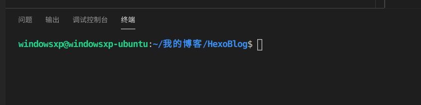

# linux常用设置
这篇文章相当于是一个笔记，记录一下我每次安装完Linux(Gnome桌面环境下)必定会做的几件事情，防止自己遗忘，当然这篇文章并不是很全面，以后如果还有还会再修改的。
<!--more-->
## 1、点击图标最小化    
```bash
gsettings set org.gnome.shell.extensions.dash-to-dock click-action 'minimize'
```
## 2、linux v2ray
    https://github.com/xbblog95/v2sub.git
    https://v2sub.betac1ouds.top/modules/servers/V2raySocks/osubscribe.php?sid=2679&token=acECX4eA8xgg
## 3、切换默认Python版本
    sudo update-alternatives --install /usr/bin/python python /usr/bin/python3 150
## 4、scrcpy
    手机无线投屏工具，也可以USB链接
## 5、peek
    GIF录制工具
## 6、sudo nautilus 
    nautilus linux文件管理工具
## 7、efibootmgr
    无效，需要禁用Windowsefi启动项否则会重置启动项
## 8、双系统时间问题
    sudo hwclock --localtime --systohc
## 9、grub 主题
[grub 主题下载](https://blog.csdn.net/Sacredness/article/details/86354020)
### 1）下载grub主题
去这里   [主题下载]( https://www.gnome-look.org/browse/cat/109/)下载自己喜欢的grub主题，下载下来后是一个压缩包。解压下载下来的压缩包，假设解压出来的目录名字叫A，A中包含了所有的文件。

### 2）将主题文件放到指定目录
在`/boot/grub`目录中新建一个目录，名字叫`themes`
将目录A拷贝到新建的目录。
打开目录A，里边有一个文件，文件名叫`theme.txt`，记下这个文件的路径，后边有用。

### 3)修改grub的主题设置
修改文件`/etc/grub.d/00_header`,在`# along with GRUB. If not, see <http://www.gnu.org/licenses/>`.这行注释下边加上一句话，这句话是：GRUB_THEME=theme文件的路径注意这句话不能加在最后边，否则就不管用了,执行命令：`update-grub`完成
## 10、安装Numix图标
```bash
    sudo add-apt-repository ppa:numix/ppa
	sudo apt-get update
	sudo apt-get install numix-gtk-theme numix-icon-theme-circle    
```
```bash
	sudo add-apt-repository ppa:papirus/papirus
	sudo apt-get update
	sudo apt-get install papirus-icon-theme
```
## 11 、vacode终端字体间距过大
去文件-首选项-设置里修改`terminal.integrated.fontFamily`

## 12、安装unrar
```bash
sudo apt-get install rar unrar
```