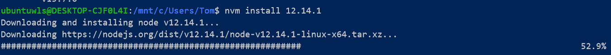

# 使用windows linux subsystem遇到的一些问题

在更换了电脑之后自然想用新电脑作为主力开发工具，博客之类的环境也自然要更换到新电脑上面来，旧电脑只装了Ubuntu，新电脑用Windows+WSL作为开发工具。

<!--more-->


## 中文设置

修改`/etc/default/locale文件`，将其修改为如下内容

```
LANG='zh_CN'
LANGUAGE='zh_CN:zh'
```

## 更换python版本

```
sudo update-alternatives --install /usr/bin/python python /usr/bin/python3 150
```

## 使用WLS

和普通安装的ubuntu一样，你可以向往常使用ubuntu一样只用WLS比如使用WLS写博客，发布博客等等，唯一的区别是说到底WLS还是一个精简的Linux，你不能指望在WLS上跑`TensorFlow`之类的大型程序。

### 安装`nnodejs`和`npm`

和在普通的Linux上一样，但是微软官方文档不建议直接使用`apt-get install nodejs`这个命令直接安装`nodejs`，原因是这个太老了，在接下来使用`npm`的时候会遇到很多问题，比如权限不够之类的。这里使用官方推荐的安装方式`nvm`来安装

[官方教程链接](https://docs.microsoft.com/en-us/windows/nodejs/setup-on-wsl2)

- 执行脚本:

```
curl -o- https://raw.githubusercontent.com/creationix/nvm/v0.33.4/install.sh | bash
```

- 更新环境变量:

```
source ~/.profile
```

- 列出所有`nodejs`版本:`nvm ls-remote`

  

  列出所有的`nodejs`版本

- 安装最新的`nodejs`版本

```
nvm install 版本号
```



安装最新的`nodejs`

安装好后你会发现`npm`同样也安装好了，剩下的操作就和以前一样了。

安装过程中会有一些警告，不必理会，这是提示你安装的模块不属于你的系统版本，这不会影响的。