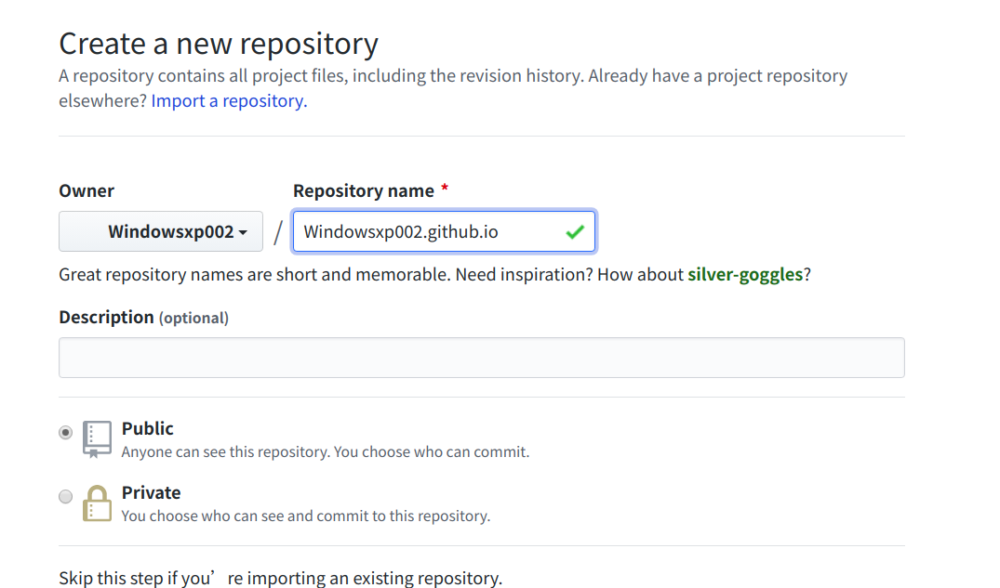
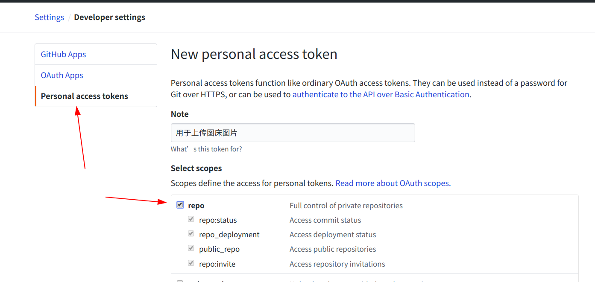
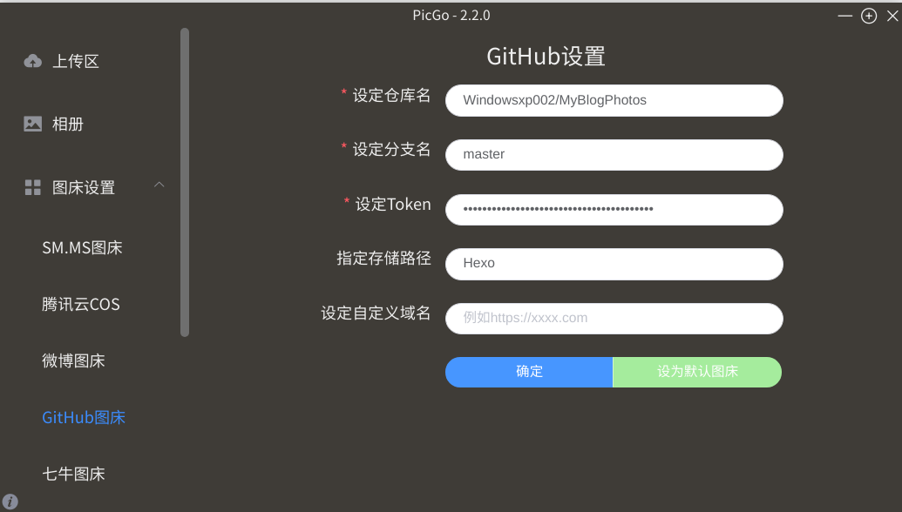
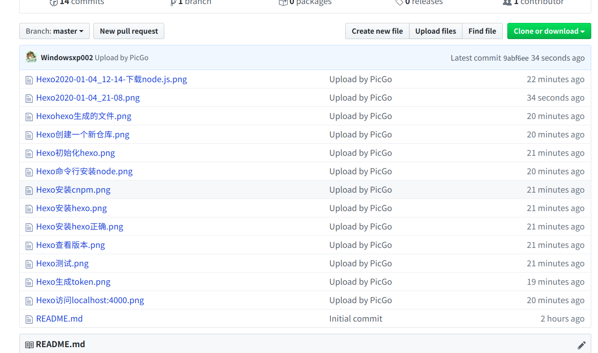

# 使用Github搭建图床

使用Github+PicGo方便快捷地搭建属于自己的图床。搭建好博客后总是想写些什么，但是一看自己以前写的东西，总觉得缺点什么，没错就是图片，在我的第一篇博客中，自己虽然每个过程都有截图，但是由于种种原因，自己并没有在MarkDown中添加任何图片这样文章就显得很枯燥。
<!-- more -->
## 前言
搭建好博客后总是想写些什么，但是一看自己以前写的东西，总觉得缺点什么，没错就是图片，在我的第一篇博客中，自己虽然每个过程都有截图，但是由于种种原因，自己并没有在MarkDown中添加任何图片，这样文章就显得很枯燥，博客文章显得干干巴巴，因此在MarkDown中添加图片就成了一件不得不做的事
## 建一个GIthub仓库
随便建立一个空的Git仓库

## 获取仓库的token
在Github的Developer setting界面生一个token，注意该Token只会显示一次，下次一旦刷新就会不见，所以务必保存好这个Token。

## 设置PicGo
在PicGo中的Github图床中设置好相应的参数。

## 测试图片是否上传
上传几张图片测试是否上传成功。
